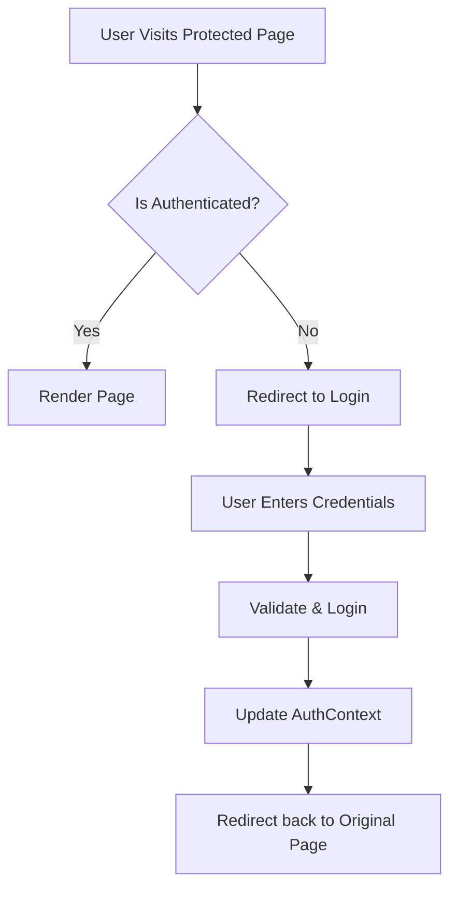

# Authentication Flow Documentation

## Overview
The authentication system in Commerce-Lab is built using `AuthContext` (React Context API) and `sessionStorage` (or `localStorage`) for persistence. It simulates a real-world JWT-based auth flow but keeps everything client-side for learning purposes.

## Architecture

### 1. AuthContext (`src/context/AuthContext.tsx`)
- **State**: `user` (User object), `isAuthenticated` (boolean), `isLoading` (boolean).
- **Actions**: `login(user)`, `logout()`.
- **Persistence**: On mount (`useEffect`), it checks `localStorage` for a saved user session to restore the state.

### 2. AuthGuard (`src/components/AuthGuard.tsx`)
- Wraps protected pages (e.g., `/mypage`, `/cart`).
- Checks `isAuthenticated`.
- If false, redirects to `/auth/login` with a `redirect` query parameter (e.g., `?redirect=/cart`).

### 3. Login Flow
1. User visits `/auth/login`.
2. Enters credentials.
3. `onSubmit` validates inputs (Zod).
4. Calls `login()` from Context.
5. Context updates state and saves to `localStorage`.
6. Router redirects to the `redirect` param or `/`.

## Diagram

