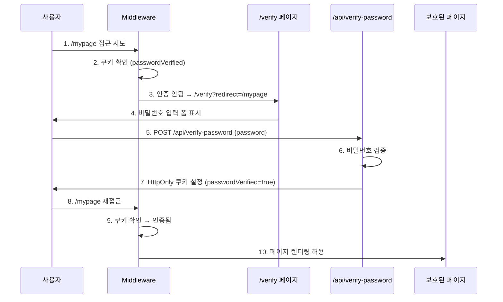

# 참고 1 - 비밀번호 페이지 인증 후 리다이렉트 페이지 개발 가이드

> **학습 목표**: Next.js Middleware를 활용한 서버 사이드 라우트 보호 시스템 구현  
> **난이도**: ⭐⭐⭐ (중급)  
> **예상 소요 시간**: 2-3시간

---

## 📋 목차

1. [개발 전 이해하기](#1-개발-전-이해하기)
2. [참고할 소스 파일](#2-참고할-소스-파일)
3. [단계별 개발 가이드](#3-단계별-개발-가이드)
4. [구조 설계 원칙](#4-구조-설계-원칙)
5. [디버깅 체크리스트](#5-디버깅-체크리스트)
6. [실전 테스트 시나리오](#6-실전-테스트-시나리오)

---

## 1. 개발 전 이해하기

### 1.1 왜 Middleware를 사용하는가?

**문제 상황:**
```
클라이언트 사이드 보호 (❌)
  ↓
브라우저 개발자 도구로 상태 조작 가능
  ↓
보안 취약점 발생
```

**해결 방법:**
```
서버 사이드 보호 (✅)
  ↓
Middleware에서 요청 차단
  ↓
HTML 자체를 전송하지 않음 (JSP 세션 체크와 동일)
```

### 1.2 핵심 개념

| 개념 | 설명 | 실무 중요도 |
|------|------|------------|
| **Middleware** | Next.js 라우터 레벨에서 실행되는 서버 사이드 코드 | ⭐⭐⭐⭐⭐ |
| **HttpOnly Cookie** | JavaScript로 접근 불가능한 쿠키 (XSS 방어) | ⭐⭐⭐⭐⭐ |
| **Server-Side Redirect** | 서버에서 리다이렉트 (클라이언트 조작 불가) | ⭐⭐⭐⭐ |
| **Edge Runtime** | CDN에서 실행되는 경량 런타임 (빠른 응답) | ⭐⭐⭐⭐ |

### 1.3 전체 플로우 이해



---

## 2. 참고할 소스 파일

### 2.1 핵심 파일 위치

```
프로젝트 루트
├── middleware.ts                          ⭐ 1순위: 라우트 가드
├── src/
│   ├── lib/
│   │   └── password-config.ts             ⭐ 2순위: 보호 경로 설정
│   └── pages/
│       ├── verify.tsx                     ⭐ 3순위: 인증 페이지
│       └── api/
│           ├── verify-password.ts         ⭐ 4순위: 인증 API
│           └── logout-password.ts         5순위: 로그아웃 API
```

### 2.2 각 파일의 역할

#### 📄 `middleware.ts` - 라우트 가드 (가장 중요)
```typescript
// 역할: 모든 요청을 가로채서 인증 체크
// 실행 시점: 페이지 렌더링 전
// 실행 위치: Edge Runtime (CDN)
```

**참고 포인트:**
- Line 5-10: `/verify` 페이지 자체는 체크 안 함 (무한 루프 방지)
- Line 14: `isProtectedPath()` 함수로 보호 경로 확인
- Line 19: HttpOnly 쿠키 읽기
- Line 23-26: 인증 실패 시 리다이렉트 로직

#### 📄 `src/lib/password-config.ts` - 설정 파일
```typescript
// 역할: 보호할 경로 목록 관리
// 수정 빈도: 높음 (새 보호 경로 추가 시)
```

**참고 포인트:**
- Line 2-8: 정확한 경로 매칭 (`PROTECTED_PATHS`)
- Line 11-15: 패턴 매칭 (`PROTECTED_PATTERNS`)
- Line 18-26: 경로 확인 로직
- Line 29: 환경 변수로 비밀번호 설정

#### 📄 `src/pages/verify.tsx` - 인증 페이지
```typescript
// 역할: 비밀번호 입력 폼
// 특징: API 호출 방식 (클라이언트 사이드)
```

**참고 포인트:**
- Line 11: 쿼리 파라미터에서 `redirect` 경로 추출
- Line 20-24: API 호출 (POST /api/verify-password)
- Line 28-30: 성공 시 원래 페이지로 리다이렉트
- Line 32-34: 실패 시 에러 메시지 표시

#### 📄 `src/pages/api/verify-password.ts` - 인증 API
```typescript
// 역할: 비밀번호 검증 및 쿠키 설정
// 실행 위치: Node.js 서버
```

**참고 포인트:**
- Line 12: 비밀번호 비교 로직
- Line 14-16: HttpOnly 쿠키 설정 (보안 핵심)
- `HttpOnly`: JavaScript 접근 차단
- `Secure`: HTTPS만 허용
- `SameSite=Strict`: CSRF 방어
- `Max-Age`: 쿠키 유효 기간 (1일)

---

## 3. 단계별 개발 가이드

### 3.1 새 보호 경로 추가하기

**시나리오:** `/admin/dashboard` 페이지를 비밀번호로 보호하고 싶다.

#### Step 1: 보호 경로 등록
```typescript
// 📁 src/lib/password-config.ts

export const PROTECTED_PATHS = [
    '/mypage',
    '/mypage/edit',
    '/order/history',
    '/order/result',
    '/protected-example',
    '/admin/dashboard',  // ✅ 추가
];
```

**또는 패턴으로 등록:**
```typescript
export const PROTECTED_PATTERNS = [
    /^\/mypage/,
    /^\/order/,
    /^\/admin/,  // ✅ /admin으로 시작하는 모든 경로
];
```

#### Step 2: 페이지 생성
```typescript
// 📁 src/pages/admin/dashboard.tsx

export default function AdminDashboard() {
    // ⚠️ 주의: 별도의 인증 로직 불필요
    // Middleware가 자동으로 체크함
    
    return (
        <div>
            <h1>관리자 대시보드</h1>
            <p>이 페이지는 비밀번호로 보호됩니다.</p>
        </div>
    );
}
```

#### Step 3: 테스트
```bash
# 1. 브라우저에서 접근
http://localhost:3000/admin/dashboard

# 2. 자동으로 리다이렉트 확인
http://localhost:3000/verify?redirect=/admin/dashboard

# 3. 비밀번호 입력 후 원래 페이지로 이동 확인
```

---

### 3.2 페이지별 다른 비밀번호 설정하기

**시나리오:** 관리자 페이지는 다른 비밀번호를 사용하고 싶다.

#### Step 1: 설정 파일 수정
```typescript
// 📁 src/lib/password-config.ts

export const PAGE_PASSWORDS: Record<string, string> = {
    '/admin': process.env.ADMIN_PASSWORD || 'admin1234',
    '/mypage': process.env.USER_PASSWORD || 'user1234',
};

export function getPasswordForPath(pathname: string): string {
    // 정확한 매칭
    if (PAGE_PASSWORDS[pathname]) {
        return PAGE_PASSWORDS[pathname];
    }
    
    // 패턴 매칭
    for (const [path, password] of Object.entries(PAGE_PASSWORDS)) {
        if (pathname.startsWith(path)) {
            return password;
        }
    }
    
    // 기본 비밀번호
    return process.env.SITE_PASSWORD || 'demo1234';
}
```

#### Step 2: API 수정
```typescript
// 📁 src/pages/api/verify-password.ts

import { getPasswordForPath } from '@/lib/password-config';

export default function handler(req: NextApiRequest, res: NextApiResponse) {
    const { password, pathname } = req.body;  // ✅ pathname 추가
    
    const correctPassword = getPasswordForPath(pathname);
    
    if (password === correctPassword) {
        res.setHeader('Set-Cookie', [
            `passwordVerified=true; Path=/; HttpOnly; Secure; SameSite=Strict; Max-Age=${60 * 60 * 24}`
        ]);
        return res.status(200).json({ success: true });
    }
    
    return res.status(401).json({ success: false, message: '비밀번호가 올바르지 않습니다.' });
}
```

#### Step 3: 클라이언트 수정
```typescript
// 📁 src/pages/verify.tsx

const handleSubmit = async (e: React.FormEvent) => {
    e.preventDefault();
    
    const response = await fetch('/api/verify-password', {
        method: 'POST',
        headers: { 'Content-Type': 'application/json' },
        body: JSON.stringify({ 
            password,
            pathname: redirect  // ✅ 경로 전달
        }),
    });
    
    // ... 나머지 로직
};
```

---

### 3.3 Rate Limiting 추가하기 (무차별 대입 공격 방어)

#### Step 1: 시도 횟수 추적
```typescript
// 📁 src/pages/api/verify-password.ts

// 메모리 기반 (간단한 구현)
const attempts = new Map<string, { count: number; resetAt: number }>();

export default function handler(req: NextApiRequest, res: NextApiResponse) {
    const ip = req.headers['x-forwarded-for'] || req.socket.remoteAddress || 'unknown';
    const now = Date.now();
    
    // 1. IP별 시도 횟수 확인
    const record = attempts.get(ip as string);
    
    if (record) {
        // 리셋 시간 지났으면 초기화
        if (now > record.resetAt) {
            attempts.delete(ip as string);
        } else if (record.count >= 5) {
            // 5회 초과 시 차단
            return res.status(429).json({ 
                success: false, 
                message: '너무 많은 시도가 있었습니다. 1분 후 다시 시도해주세요.' 
            });
        }
    }
    
    const { password } = req.body;
    
    if (password === SITE_PASSWORD) {
        // 성공 시 기록 삭제
        attempts.delete(ip as string);
        
        res.setHeader('Set-Cookie', [
            `passwordVerified=true; Path=/; HttpOnly; Secure; SameSite=Strict; Max-Age=${60 * 60 * 24}`
        ]);
        return res.status(200).json({ success: true });
    }
    
    // 실패 시 카운트 증가
    const current = attempts.get(ip as string);
    attempts.set(ip as string, {
        count: (current?.count || 0) + 1,
        resetAt: now + 60 * 1000  // 1분 후 리셋
    });
    
    return res.status(401).json({ success: false, message: '비밀번호가 올바르지 않습니다.' });
}
```

---

### 3.4 로그아웃 기능 추가하기

#### Step 1: API 생성 (이미 있음)
```typescript
// 📁 src/pages/api/logout-password.ts

import type { NextApiRequest, NextApiResponse } from 'next';

export default function handler(req: NextApiRequest, res: NextApiResponse) {
    // 쿠키 삭제 (Max-Age=0)
    res.setHeader('Set-Cookie', [
        'passwordVerified=; Path=/; HttpOnly; Secure; SameSite=Strict; Max-Age=0'
    ]);
    
    return res.status(200).json({ success: true });
}
```

#### Step 2: 컴포넌트에 로그아웃 버튼 추가
```typescript
// 📁 src/components/Header.tsx (예시)

const handleLogout = async () => {
    await fetch('/api/logout-password', { method: 'POST' });
    router.push('/');
};

return (
    <button onClick={handleLogout}>
        🔓 로그아웃
    </button>
);
```

---

## 4. 구조 설계 원칙

### 4.1 관심사의 분리 (Separation of Concerns)

```
📁 middleware.ts
  역할: 라우트 가드 (인증 체크만)
  책임: 쿠키 확인 → 리다이렉트
  
📁 password-config.ts
  역할: 설정 관리
  책임: 보호 경로 목록, 비밀번호 설정
  
📁 verify-password.ts
  역할: 비즈니스 로직
  책임: 비밀번호 검증, 쿠키 설정
  
📁 verify.tsx
  역할: UI
  책임: 사용자 입력, API 호출
```

### 4.2 확장 가능한 구조

**나쁜 예:**
```typescript
// ❌ Middleware에 모든 로직 집중
export function middleware(request: NextRequest) {
    const password = request.headers.get('password');
    if (password !== 'demo1234') {
        return NextResponse.redirect('/verify');
    }
    // ... 100줄의 코드
}
```

**좋은 예:**
```typescript
// ✅ 설정과 로직 분리
import { isProtectedPath } from './src/lib/password-config';

export function middleware(request: NextRequest) {
    if (!isProtectedPath(request.nextUrl.pathname)) {
        return NextResponse.next();
    }
    
    const isVerified = request.cookies.get('passwordVerified')?.value === 'true';
    if (!isVerified) {
        return redirectToVerify(request);
    }
    
    return NextResponse.next();
}
```

### 4.3 보안 우선 설계

```typescript
// ✅ 보안 체크리스트
const securityChecklist = {
    httpOnly: true,        // JavaScript 접근 차단
    secure: true,          // HTTPS만 허용
    sameSite: 'Strict',    // CSRF 방어
    maxAge: 86400,         // 쿠키 만료 시간 설정
    serverSide: true,      // 서버에서 검증
};
```

---

## 5. 디버깅 체크리스트

### 5.1 인증이 작동하지 않을 때

#### ✅ Step 1: Middleware 실행 확인
```typescript
// 📁 middleware.ts

export function middleware(request: NextRequest) {
    console.log('🔍 Middleware 실행:', request.nextUrl.pathname);  // ✅ 추가
    
    const { pathname } = request.nextUrl;
    
    if (pathname === '/verify') {
        console.log('✅ /verify 페이지 - 통과');  // ✅ 추가
        return NextResponse.next();
    }
    
    if (!isProtectedPath(pathname)) {
        console.log('✅ 보호 경로 아님 - 통과');  // ✅ 추가
        return NextResponse.next();
    }
    
    const isVerified = request.cookies.get('passwordVerified')?.value === 'true';
    console.log('🍪 쿠키 확인:', isVerified);  // ✅ 추가
    
    // ...
}
```

**확인 방법:**
```bash
# 터미널에서 로그 확인
npm run dev

# 브라우저에서 페이지 접근 후 터미널 확인
```

#### ✅ Step 2: 쿠키 설정 확인
```
브라우저 개발자 도구 → Application → Cookies
  ↓
passwordVerified 쿠키 확인
  ↓
값: true
HttpOnly: ✅
Secure: ✅
SameSite: Strict
```

**쿠키가 없다면:**
1. API 응답 헤더 확인 (Network 탭)
2. `Set-Cookie` 헤더가 있는지 확인
3. HTTPS 환경인지 확인 (Secure 플래그 때문)

#### ✅ Step 3: 경로 매칭 확인
```typescript
// 📁 src/lib/password-config.ts

export function isProtectedPath(pathname: string): boolean {
    console.log('🔍 경로 체크:', pathname);  // ✅ 추가
    
    if (PROTECTED_PATHS.includes(pathname)) {
        console.log('✅ 정확한 경로 매칭');  // ✅ 추가
        return true;
    }
    
    const matched = PROTECTED_PATTERNS.some(pattern => pattern.test(pathname));
    console.log('🔍 패턴 매칭:', matched);  // ✅ 추가
    return matched;
}
```

### 5.2 무한 리다이렉트 발생 시

**원인:**
```
/verify 페이지도 보호 경로로 설정됨
  ↓
/verify 접근 → Middleware 체크 → /verify로 리다이렉트
  ↓
무한 루프
```

**해결:**
```typescript
// 📁 middleware.ts

export function middleware(request: NextRequest) {
    const { pathname } = request.nextUrl;
    
    // ✅ /verify 페이지는 항상 통과
    if (pathname === '/verify') {
        return NextResponse.next();
    }
    
    // ... 나머지 로직
}
```

### 5.3 API 호출 실패 시

#### 디버깅 코드 추가
```typescript
// 📁 src/pages/verify.tsx

const handleSubmit = async (e: React.FormEvent) => {
    e.preventDefault();
    
    console.log('📤 API 요청:', { password });  // ✅ 추가
    
    try {
        const response = await fetch('/api/verify-password', {
            method: 'POST',
            headers: { 'Content-Type': 'application/json' },
            body: JSON.stringify({ password }),
        });
        
        console.log('📥 응답 상태:', response.status);  // ✅ 추가
        
        const data = await response.json();
        console.log('📥 응답 데이터:', data);  // ✅ 추가
        
        // ... 나머지 로직
    } catch (err) {
        console.error('❌ API 에러:', err);  // ✅ 추가
    }
};
```

**확인 사항:**
1. Network 탭에서 요청 확인
2. 요청 Body가 올바른지 확인
3. 응답 상태 코드 확인 (200, 401, 500 등)
4. CORS 에러 확인

---

## 6. 실전 테스트 시나리오

### 6.1 기본 플로우 테스트

```
✅ 시나리오 1: 정상 인증 플로우
1. /mypage 접근
2. /verify로 리다이렉트 확인
3. 올바른 비밀번호 입력 (demo1234)
4. /mypage로 리다이렉트 확인
5. 페이지 정상 렌더링 확인

✅ 시나리오 2: 잘못된 비밀번호
1. /mypage 접근
2. /verify로 리다이렉트
3. 잘못된 비밀번호 입력
4. 에러 메시지 표시 확인
5. 입력 필드 초기화 확인

✅ 시나리오 3: 인증 후 다른 보호 페이지 접근
1. /mypage 인증 완료
2. /order/history 접근
3. 추가 인증 없이 바로 접근 확인 (쿠키 공유)

✅ 시나리오 4: 로그아웃 후 재접근
1. 로그아웃 버튼 클릭
2. /mypage 접근
3. /verify로 리다이렉트 확인
```

### 6.2 보안 테스트

```
✅ 시나리오 5: 쿠키 조작 시도
1. 개발자 도구 → Application → Cookies
2. passwordVerified 쿠키 수동 생성 시도
3. HttpOnly 플래그로 인해 생성 불가 확인

✅ 시나리오 6: 클라이언트 스크립트 조작
1. 콘솔에서 document.cookie 확인
2. HttpOnly 쿠키는 보이지 않음 확인
3. JavaScript로 쿠키 설정 시도
4. 실패 확인

✅ 시나리오 7: 직접 URL 접근
1. 브라우저에 /mypage URL 직접 입력
2. Middleware가 차단하는지 확인
3. /verify로 리다이렉트 확인
```

### 6.3 엣지 케이스 테스트

```
✅ 시나리오 8: 쿠키 만료
1. 쿠키 Max-Age를 10초로 설정
2. 인증 완료
3. 10초 대기
4. 보호 페이지 재접근
5. /verify로 리다이렉트 확인

✅ 시나리오 9: 여러 탭에서 동시 접근
1. 탭 A에서 인증 완료
2. 탭 B에서 보호 페이지 접근
3. 쿠키 공유로 인증 없이 접근 확인

✅ 시나리오 10: Rate Limiting
1. 잘못된 비밀번호 5회 입력
2. 6번째 시도 시 차단 확인
3. 1분 대기 후 재시도 가능 확인
```

---

## 7. 실무 체크리스트

### 7.1 배포 전 확인사항

```
□ .env.local에 실제 비밀번호 설정
  SITE_PASSWORD=your_secure_password_here

□ HttpOnly, Secure, SameSite 플래그 모두 활성화

□ Rate Limiting 구현 (선택)

□ 쿠키 만료 시간 적절히 설정 (1일 ~ 7일)

□ 프로덕션 환경에서 HTTPS 사용 확인

□ 에러 메시지가 보안 정보 노출하지 않는지 확인
  ❌ "비밀번호는 8자리입니다"
  ✅ "비밀번호가 올바르지 않습니다"

□ 로그에 민감한 정보 출력하지 않는지 확인
  ❌ console.log('입력된 비밀번호:', password)
  ✅ console.log('비밀번호 검증 시도')
```

### 7.2 성능 최적화

```
□ Middleware는 Edge Runtime에서 실행 (빠름)

□ 불필요한 경로는 matcher에서 제외
  export const config = {
    matcher: ['/((?!api|_next/static|_next/image|favicon.ico).*)'],
  };

□ 쿠키 크기 최소화 (필요한 정보만)

□ 비밀번호 검증 로직 최적화 (해시 비교 등)
```

---

## 8. 추가 학습 자료

### 8.1 Next.js 공식 문서
- [Middleware](https://nextjs.org/docs/app/building-your-application/routing/middleware)
- [API Routes](https://nextjs.org/docs/pages/building-your-application/routing/api-routes)
- [Cookies](https://nextjs.org/docs/app/api-reference/functions/cookies)

### 8.2 보안 관련
- [OWASP - Session Management](https://owasp.org/www-community/controls/Session_Management_Cheat_Sheet)
- [HttpOnly Cookie](https://developer.mozilla.org/en-US/docs/Web/HTTP/Cookies#restrict_access_to_cookies)
- [SameSite Cookie](https://web.dev/samesite-cookies-explained/)

---

## 9. 요약

### 핵심 포인트

1. **Middleware는 서버 사이드 라우트 가드**
   - JSP 세션 체크와 동일한 수준의 보안
   - 클라이언트 조작 불가능

2. **HttpOnly 쿠키는 필수**
   - JavaScript 접근 차단 (XSS 방어)
   - Secure + SameSite로 CSRF 방어

3. **설정과 로직 분리**
   - `password-config.ts`: 보호 경로 관리
   - `middleware.ts`: 인증 체크
   - `verify-password.ts`: 비즈니스 로직

4. **디버깅은 단계별로**
   - Middleware 실행 확인
   - 쿠키 설정 확인
   - 경로 매칭 확인
   - API 응답 확인

---

**마지막 팁:** 이 가이드를 따라 개발하면서 각 단계마다 체크리스트를 확인하세요. 막히는 부분이 있으면 디버깅 섹션을 참고하세요! 🚀
